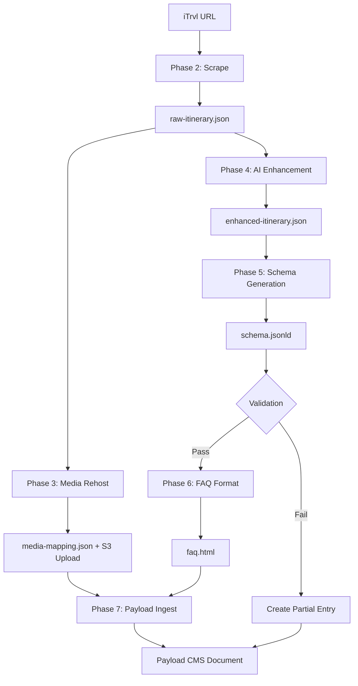

# iTrvl Itinerary Scraper Documentation

## Overview

The iTrvl Scraper is a serverless pipeline that scrapes travel itineraries from iTrvl.com, processes and enhances the content using AI, generates SEO-friendly JSON-LD schema, and ingests everything into Payload CMS with media stored in AWS S3.

**Current State**: Production-ready implementation running on Vercel serverless functions.
**Last Updated**: November 15, 2024

---

## Architecture

### System Components

```
Next.js App (Vercel)
    ├── API Route: /api/scrape-itinerary
    └── Pipeline Orchestrator: pipelines/run_full_pipeline.cjs
            ├── Phase 2: Scraping (scrapers/itrvl_scraper.cjs)
            ├── Phase 3: Media Rehosting (processors/media_rehoster.cjs)
            ├── Phase 4: Content Enhancement (processors/content_enhancer.cjs)
            ├── Phase 5: Schema Generation (processors/schema_generator.cjs)
            ├── Phase 6: FAQ Formatting (processors/faq_formatter.cjs)
            └── Phase 7: Payload Ingestion (loaders/payload_ingester.cjs)
```

### Key Files

- **Entry Point**: `src/app/(payload)/api/scrape-itinerary/route.ts`
- **Pipeline**: `pipelines/run_full_pipeline.cjs`
- **Scrapers**: `scrapers/itrvl_scraper.cjs`
- **Processors**: `processors/*.cjs` (4 files)
- **Loaders**: `loaders/payload_ingester.cjs`
- **Schemas**: `schemas/kiuli-product.schema.json`
- **Validation**: `validation_scripts/validate_phase_*.cjs` (8 files)

---

## Pipeline Phases

### Phase 2: Scraping (`scrapers/itrvl_scraper.cjs`)

**Purpose**: Scrape itinerary data from iTrvl.com using headless Chromium

**Technology**:
- Puppeteer Core v24.30.0
- @sparticuz/chromium v141.0.0 (Chromium binary for Lambda/Vercel)
- @puppeteer/browsers v2.10.13

**Input**: iTrvl URL (format: `https://itrvl.com/client/portal/{accessKey}/{itineraryId}`)

**Process**:
1. Launch headless Chromium browser
2. Navigate to iTrvl portal URL
3. Wait for page load and extract itinerary data
4. Parse JSON data from page

**Output**: `/tmp/output/raw-itinerary.json` (or `./output/` locally)

**Error Handling**: Fails pipeline if scraping unsuccessful

---

### Phase 3: Media Rehosting (`processors/media_rehoster.cjs`)

**Purpose**: Download all media from iTrvl URLs and upload to AWS S3

**Technology**:
- axios v1.13.2 for HTTP requests
- form-data v4.0.4 for multipart uploads
- @payloadcms/storage-s3 plugin

**Process**:
1. Read `raw-itinerary.json`
2. Extract all image URLs from itinerary
3. Download each image via axios
4. Upload to S3 via Payload Media API
5. Create mapping: original URL → Payload Media ID

**Output**:
- Media files in S3 bucket
- `/tmp/output/media-mapping.json` with URL-to-ID mappings

**S3 Configuration**:
- Bucket: Configured via `AWS_S3_BUCKET` env var
- Region: Configured via `AWS_S3_REGION` env var
- Credentials: `AWS_ACCESS_KEY_ID`, `AWS_SECRET_ACCESS_KEY`

---

### Phase 4: Content Enhancement (`processors/content_enhancer.cjs`)

**Purpose**: Enhance itinerary descriptions using Google Gemini AI

**Technology**:
- @google/generative-ai v0.24.1
- Model: gemini-1.5-pro

**Process**:
1. Read `raw-itinerary.json`
2. Extract descriptions from days/activities
3. Send to Gemini API for enhancement
4. Replace original descriptions with enhanced versions

**Output**: `/tmp/output/enhanced-itinerary.json`

**API Configuration**:
- API Key: `GOOGLE_GEMINI_API_KEY` env var
- Temperature: 0.7
- Max tokens: 2000 per description

---

### Phase 5: Schema Generation (`processors/schema_generator.cjs`)

**Purpose**: Generate Google-compliant JSON-LD schema for SEO

**Technology**:
- Custom schema generator
- ajv v8.17.1 for validation
- ajv-formats v3.0.1

**Process**:
1. Read `enhanced-itinerary.json`
2. Transform to schema.org format (TouristTrip + TouristAttraction)
3. Validate against `schemas/kiuli-product.schema.json`
4. If validation fails, create partial Payload entry with failure status

**Output**: `/tmp/output/schema.jsonld`

**Schema Types**:
- `@type`: ["Product", "TouristTrip"]
- Includes: name, description, offers, itinerary, aggregateRating

**Validation**: JSON Schema validation with Ajv before proceeding

---

### Phase 6: FAQ Formatting (`processors/faq_formatter.cjs`)

**Purpose**: Format FAQ content from itinerary into HTML

**Process**:
1. Read `enhanced-itinerary.json`
2. Extract FAQ section if present
3. Format as structured HTML
4. Generate schema.org/FAQPage markup

**Output**: `/tmp/output/faq.html`

---

### Phase 7: Payload Ingestion (`loaders/payload_ingester.cjs`)

**Purpose**: Create itinerary entry in Payload CMS

**Technology**:
- axios for REST API calls
- Payload CMS REST API

**Process**:
1. Read all output files (raw, enhanced, schema, faq, media-mapping)
2. Build Payload document structure
3. POST to `/api/itineraries` endpoint
4. Save returned document ID

**Payload Structure**:
```javascript
{
  title: string,
  images: [mediaId1, mediaId2, ...],  // References to media collection
  rawItinerary: object,                 // Original scraped data
  enhancedItinerary: object,            // AI-enhanced version
  schema: object,                       // JSON-LD schema
  faq: string,                          // HTML formatted FAQ
  schemaStatus: 'pass' | 'fail',
  googleInspectionStatus: 'pending',
  buildTimestamp: ISO8601 date,
  _status: 'draft'
}
```

**Output**:
- `/tmp/output/payload_id.txt` containing the created document ID
- Document in Payload CMS database

**API Configuration**:
- URL: `PAYLOAD_API_URL` env var
- Auth: `PAYLOAD_API_KEY` env var (API-Key authentication)

---

## Deployment Architecture

### Serverless Execution (Vercel)

**Platform**: Vercel Serverless Functions
**Runtime**: Node.js 18.x / 20.x
**Timeout**: Default (likely need to verify actual configured timeout)

**Key Serverless Adaptations**:
1. **Output Directory**: `/tmp/output/` in serverless, `./output/` locally
2. **Direct Function Calls**: All phases use `require()` and direct function calls (NOT child_process.spawn)
3. **File Tracing**: Comprehensive dependency inclusion via `next.config.js`

### File Tracing Configuration

The `next.config.js` includes extensive `outputFileTracingIncludes` configuration to ensure all dependencies are bundled:

**Critical Dependencies Included**:
- Puppeteer ecosystem: `@sparticuz/chromium`, `@puppeteer/**`, `puppeteer-core`, `puppeteer`
- Chromium extraction: `tar-fs`, `extract-zip`, `unbzip2-stream`, etc.
- Proxy support: `proxy-agent`, `agent-base`, etc.
- Processor deps: `dotenv`, `axios`, `form-data`, `ajv`, `ajv-formats`
- AI: `@google/generative-ai`

### Environment Variables

**Required**:
```bash
# Payload CMS
PAYLOAD_API_URL=https://your-domain.com
PAYLOAD_API_KEY=your-api-key

# AWS S3
AWS_S3_BUCKET=your-bucket-name
AWS_S3_REGION=us-east-1
AWS_ACCESS_KEY_ID=your-access-key
AWS_SECRET_ACCESS_KEY=your-secret-key

# Google Gemini AI
GOOGLE_GEMINI_API_KEY=your-gemini-api-key

# Database (Vercel Postgres)
POSTGRES_URL=your-postgres-connection-string
```

**Optional**:
```bash
# Vercel (auto-injected)
VERCEL=1
VERCEL_ENV=production

# Payload
PAYLOAD_SECRET=your-payload-secret
```

---

## Data Flow



---

## API Usage

### Endpoint

```
POST /api/scrape-itinerary
Content-Type: application/json

{
  "itrvlUrl": "https://itrvl.com/client/portal/{accessKey}/{itineraryId}"
}
```

### Response

**Success (200)**:
```json
{
  "success": true,
  "payloadId": "67abc123def45678",
  "duration": 48.49,
  "timings": {
    "phase2": "15.59",
    "phase3": "24.75",
    "phase4": "5.60",
    "phase567": "2.56"
  },
  "message": "Itinerary processed successfully"
}
```

**Partial Success (Validation Failed)**:
```json
{
  "success": false,
  "payloadId": "67abc123def45678",
  "phase": "validation",
  "error": "Schema validation failed: ...",
  "duration": 35.20,
  "timings": { ... }
}
```

**Error (500)**:
```json
{
  "success": false,
  "error": "Error message here"
}
```

---

## Testing

### Validation Scripts

Located in `validation_scripts/`, these scripts test individual phases:

- `validate_phase_0.cjs`: Test URL parsing
- `validate_phase_2.cjs`: Test scraping
- `validate_phase_3.cjs`: Test media rehosting
- `validate_phase_4.cjs`: Test AI enhancement
- `validate_phase_5.cjs`: Test schema generation
- `validate_phase_6.cjs`: Test FAQ formatting
- `validate_phase_7.cjs`: Test Payload ingestion
- `validate_phase_8.cjs`: End-to-end integration test

### Test iTrvl URLs

Sample URLs for testing (from `/Users/grahamwallington/Downloads/iTrvl sample itiniaries.md`):
```
https://itrvl.com/client/portal/sDafv7StYWDPEpQdzRZz4FB9ibXs803AxtuQ48eH15ixoHKVg3R5YvxOFCUZMzFa/680dff493cf205005cf76e8f
https://itrvl.com/client/portal/Ir0nIrtJMhtj3RUzrj8Qyqw7XTIyA4NGk22g52ZHTmhD6IcgxNcRUNwhXTKXbgKa/680df70720a6c6005b2bfc34
https://itrvl.com/client/portal/Op4IPe4KvCsHC7QuCxjWLQEa0JlM5eVGE0vAGUD9yRnUmAIwpwstlE85upkxlfTJ/680dfc35819f37005c255a29
https://itrvl.com/client/portal/GCDp9oahYn8nuuwhp8b3JvnUWpO51RUTAcHT6w5fL8WvhDVbCq5bhceamIcQGBQV/680df9b0819f37005c255a1c
https://itrvl.com/client/portal/RySYf1f1xoKGC2UaZGLIuS9GT8Qb3vTmcSBfGGN94rUciM7xo09kEW07FGI3I8h3/680df1803cf205005cf76e37
https://itrvl.com/client/portal/SJK1xYm749VERKthohc6iSVAHZY5mZdBFIDkxcdiZIuK4O554kXRCEvNum9yVpFm/680df8bb3cf205005cf76e57
```

### Manual Testing

```bash
# Local testing
curl -X POST http://localhost:3000/api/scrape-itinerary \
  -H "Content-Type: application/json" \
  -d '{"itrvlUrl": "https://itrvl.com/client/portal/sDafv7StYWDPEpQdzRZz4FB9ibXs803AxtuQ48eH15ixoHKVg3R5YvxOFCUZMzFa/680dff493cf205005cf76e8f"}'

# Production testing
curl -X POST https://kiuli.com/api/scrape-itinerary \
  -H "Content-Type: application/json" \
  -d '{"itrvlUrl": "https://itrvl.com/client/portal/sDafv7StYWDPEpQdzRZz4FB9ibXs803AxtuQ48eH15ixoHKVg3R5YvxOFCUZMzFa/680dff493cf205005cf76e8f"}'
```

---

## Known Limitations

1. **No Pagination Support**: Scraper assumes single-page itineraries
2. **AI Enhancement Rate Limits**: Subject to Google Gemini API rate limits
3. **Media Upload Timeout**: Large number of images may timeout in serverless environment
4. **No Retry Logic**: Failed phases do not automatically retry
5. **Validation Failures**: Create partial entries but don't retry generation

---

## Troubleshooting

### Common Errors

**"Cannot find module 'puppeteer-core'"**
- Check `next.config.js` includes Puppeteer dependencies in file tracing

**"Input file not found: /var/task/output/..."**
- Verify processors use `getOutputDir()` helper, not hardcoded paths

**"Schema validation failed"**
- Check `schemas/kiuli-product.schema.json` matches data structure
- Review Phase 5 output for missing/malformed fields

**"Payload API credentials not configured"**
- Verify `PAYLOAD_API_URL` and `PAYLOAD_API_KEY` environment variables

**Media not attached to itinerary**
- Check Phase 3 completed successfully
- Verify `media-mapping.json` exists
- Confirm S3 credentials are correct

---

## Critical Implementation Details

### Serverless Antipatterns (FIXED)

**Previous Issue** (FIXED in commit c6b5812):
- Pipeline previously used `child_process.spawn()` to execute phases
- This caused filesystem isolation between processes in serverless
- Files written to /tmp by child processes were not visible to parent

**Current Implementation**:
- All phases use direct function calls via `require()`
- Single Node.js process executes entire pipeline
- Data persists correctly in /tmp between phases

### Storage Configuration

**S3 Only** (NOT Vercel Blob):
- Single storage plugin: `@payloadcms/storage-s3`
- Previous `@payloadcms/storage-vercel-blob` dependency removed (commit 3d1793d)
- Media files stored in AWS S3
- Payload API returns S3 URLs (not local paths)

### Build Process

**No Bundling**:
- Source `.cjs` files called directly (not bundled)
- Previous `bundle:scraper` and `prebuild` scripts removed (commit 3d1793d)
- Vercel handles file tracing via `next.config.js`

---

## Dependencies

### Production Dependencies

```json
{
  "@google/generative-ai": "^0.24.1",
  "@payloadcms/storage-s3": "^3.63.0",
  "@puppeteer/browsers": "^2.10.13",
  "@sparticuz/chromium": "^141.0.0",
  "agent-base": "^7.1.4",
  "ajv": "^8.17.1",
  "ajv-formats": "^3.0.1",
  "axios": "^1.13.2",
  "dotenv": "16.4.7",
  "form-data": "^4.0.4",
  "proxy-agent": "^6.5.0",
  "puppeteer": "^24.29.1",
  "puppeteer-core": "^24.30.0"
}
```

### Why Each Dependency

- **Puppeteer ecosystem**: Headless browser automation for scraping
- **@sparticuz/chromium**: Chromium binary optimized for Lambda/Vercel
- **Google Generative AI**: AI-powered content enhancement
- **Payload S3 Storage**: Media file storage in AWS S3
- **ajv + ajv-formats**: JSON Schema validation
- **axios**: HTTP client for API calls
- **form-data**: Multipart file uploads
- **proxy-agent**: Proxy support for Puppeteer
- **dotenv**: Environment variable management

---

## Recent Changes

### November 15, 2024 - Repository Cleanup (commit 3d1793d)
- Removed obsolete `output/`, `scrapers/dist/`, `pipelines/dist/` directories
- Updated `.gitignore` to ignore build artifacts
- Removed unused `@payloadcms/storage-vercel-blob` dependency
- Removed obsolete bundling scripts (`bundle:scraper`, `prebuild`)
- Cleaned up `next.config.js` file tracing configuration

### November 15, 2024 - Critical Pipeline Fix (commit c6b5812)
- **BREAKING CHANGE**: Complete rewrite of `run_full_pipeline.cjs`
- Replaced `child_process.spawn()` with direct function calls
- Fixed data loss issue in serverless environment
- All phases now execute in single Node.js process

---

## Future Considerations

1. **Retry Logic**: Add automatic retry for failed phases
2. **Queue System**: Implement job queue for high-volume processing
3. **Caching**: Cache scraped data to reduce redundant requests
4. **Monitoring**: Add APM/logging for production monitoring
5. **Webhooks**: Support webhook notifications on completion
6. **Batch Processing**: Support processing multiple URLs in single request

---

## Support

For issues or questions:
1. Check `validation_scripts/` for debugging individual phases
2. Review Vercel deployment logs via `vercel logs kiuli.com`
3. Inspect Payload CMS entries via admin panel
4. Check S3 bucket for uploaded media files
